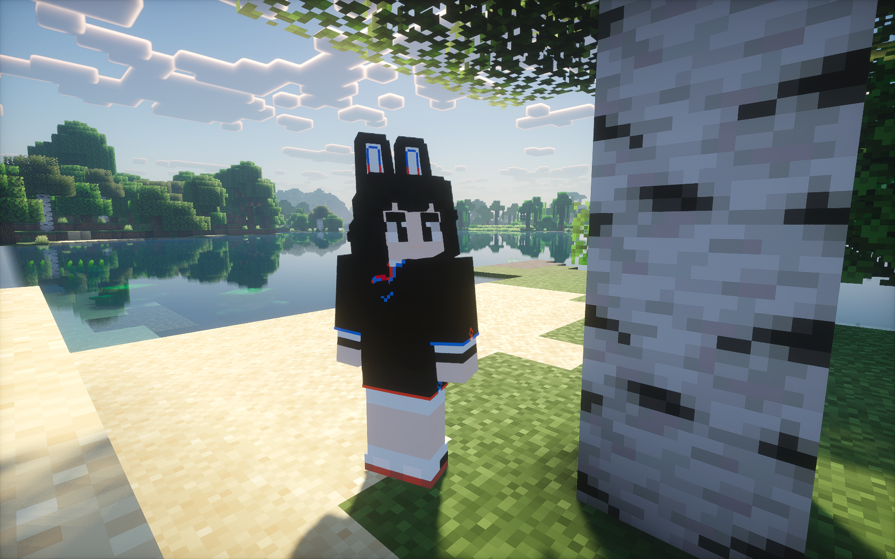

An-An: Minecraft Avatar (Figura)
===

[简体中文自述文件 >>](README.zh-cn.md)

Minecraft avatar imitating An-An, mascot of Anthon Open Source Community.

For more information on An-An and Tong-Tong, her companion, please refer to AOSC's page on [community mascots](https://aosc.io/mascot).

Requirements
---

As this avatar is built for [Figura](https://figuramc.org/), you would need to install it in Minecraft.

About Action Animations and Other Effects
---

The base model has been completed and is available for download in the releases section. This version does not include any effects (suffix: basemodel).

Character models with action animations are currently in production and will be released subsequently (suffix: fullmodel).

Implement animation effects making use of [JimmyAnims](https://github.com/JimmyHelp/JimmyAnims).In the future, more third-party Lua APIs may be utilized to achieve animations.

